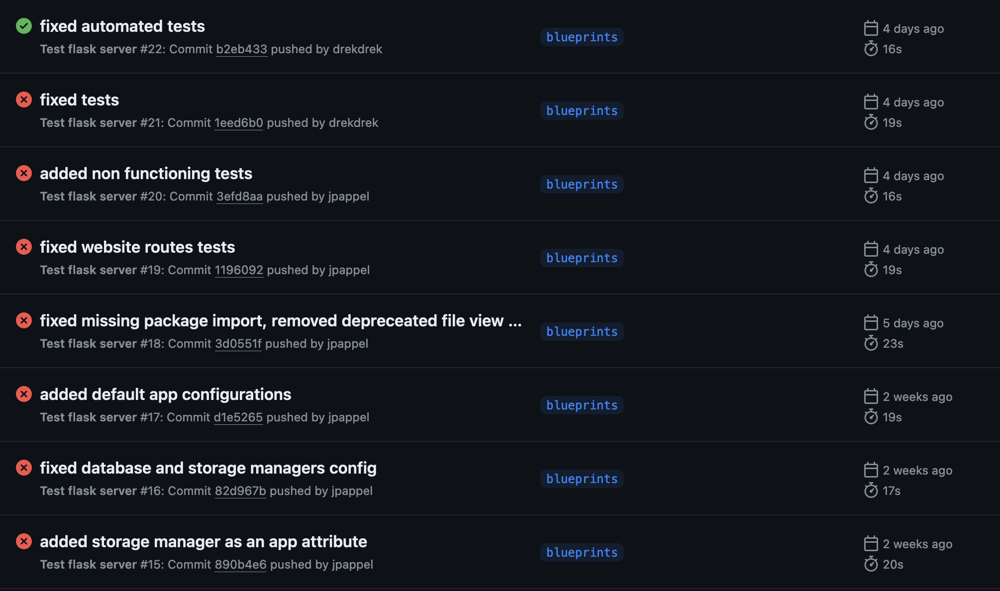

<!-- TODO: include logo-->

## File Hosting

::: {.flex}

:::: {.col}
{width=420px}
::::

:::: {.col}
{width=420px} 
::::

:::

::: notes
Owen

* describe problem
* describe existing solutions (imgur, imgbb, etc)
* describe problems with existing solutions
:::

## Architecture

<!-- TODO: include updated diagram -->

::: notes
JP

* this application is relatively portable
* everything is running in a docker container
* client requests hit nginx which redirects as necessary
* gunicorn used as wsgi server
* flask backend, connects directly mariadb container and block storage volume
:::

## Deployment

<!-- TODO: show docker image -->

. . .

```bash
docker compose up -d
docker compose down -v
```

::: notes
JP

* you may wonder how we manage deployment with a stack as seen on the slide prior
* docker compose allows us to start and stop our application with a single command
* in repo a script is provided to deploy on an ec2 instances running amazon linux
* for today's demo we are running on one of owen's machines
    * this is to avoid having to transfer our https certificates
:::

## Interfaces

### Web

### API

<!-- TODO: show a list of functioning endpoints -->

### CLI

## Demo

## GitHub Workflows



::: notes
Owen

:::

## 


::: notes
JP

* a way that our architecture differs from other groups is Nginx
* nginx is a reverse proxy and web server known for its speed
* by placing nginx at the edge of our network we can change internal network interfaces without affecting the client
* additionally nginx provides additional features such as
    * limiting upload size
    * automatically redirecting http traffic to https
    * faster serving of static files
:::

## HTTPS


## Lessons Learned

* test, test, test!
* mocking is difficult all the times

## Future Work

* authentication
    * privacy settings
* S3/Object Storage
* collections
